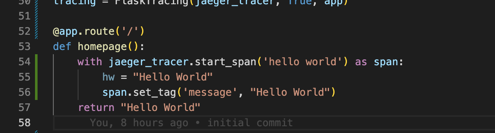

**Note:** For the screenshots, you can store all of your answer images in the `answer-img` directory.

## Verify the monitoring installation

*TODO:* run `kubectl` command to show the running pods and services for all components. Take a screenshot of the output and include it here to verify the installation


## Setup the Jaeger and Prometheus source
*TODO:* Expose Grafana to the internet and then setup Prometheus as a data source. Provide a screenshot of the home page after logging into Grafana.


## Create a Basic Dashboard
*TODO:* Create a dashboard in Grafana that shows Prometheus as a source. Take a screenshot and include it here.


## Describe SLO/SLI
*TODO:* Describe, in your own words, what the SLIs are, based on an SLO of *monthly uptime* and *request response time*.

```
SLO - The goal of performance in a measurable period of time for e.g. 99% server uptime in a month
SLI - The measurement of performance in a period of time for e.g. There is 98% server uptime in a month
```

## Creating SLI metrics.
*TODO:* It is important to know why we want to measure certain metrics for our customer. Describe in detail 5 metrics to measure these SLIs. 

```
* Latency
* Durability
* Response time
* Availability
* Throughput
```

## Create a Dashboard to measure our SLIs
*TODO:* Create a dashboard to measure the uptime of the frontend and backend services We will also want to measure to measure 40x and 50x errors. Create a dashboard that show these values over a 24 hour period and take a screenshot.


## Tracing our Flask App
*TODO:*  We will create a Jaeger span to measure the processes on the backend. Once you fill in the span, provide a screenshot of it here. Also provide a (screenshot) sample Python file containing a trace and span code used to perform Jaeger traces on the backend service.




## Jaeger in Dashboards
*TODO:* Now that the trace is running, let's add the metric to our current Grafana dashboard. Once this is completed, provide a screenshot of it here.


## Report Error
*TODO:* Using the template below, write a trouble ticket for the developers, to explain the errors that you are seeing (400, 500, latency) and to let them know the file that is causing the issue also include a screenshot of the tracer span to demonstrate how we can user a tracer to locate errors easily.


```

Name: Error 500 while trying to visit /trace 
Date: 1st January 2023 , 15:00
Subject: Trial service route /trace showing internal error 500
Affected Area: Trial service
Severity: High Severity
Description: Accessing /trace route in trial service get error 500.

```


## Creating SLIs and SLOs
*TODO:* We want to create an SLO guaranteeing that our application has a 99.95% uptime per month. Name four SLIs that you would use to measure the success of this SLO.


```

- Resource consumption - CPU and memory usage
- Service availability - Backend/Frontend availability
- Response error occurrence - HTTP 4xx and 5xx status code
- Service response - Number of request and Response time 

```

## Building KPIs for our plan
*TODO*: Now that we have our SLIs and SLOs, create a list of 2-3 KPIs to accurately measure these metrics as well as a description of why those KPIs were chosen. We will make a dashboard for this, but first write them down here.

```

1. Server CPU and memory usage,ensure sufficient resources is provided to the application to minimize potential issue.
    - Server CPU usage
    - Server Memory Usage

2. Measure the availability of services
    - Measure Backend Availability
    - Measure Frontend Availability

3. Track and measure potential non-successful request obtained
    - Error 4xx measure
    - Error 5xx measure
    
4. Services Request and Response time averagely needed per request.
    - Total requests per minute
    - Average response

```

## Final Dashboard
*TODO*: Create a Dashboard containing graphs that capture all the metrics of your KPIs and adequately representing your SLIs and SLOs. Include a screenshot of the dashboard here, and write a text description of what graphs are represented in the dashboard.  


First and second row of the dashboard show the total CPU usage and Memory usage from the current resources.
Third row diagram show Backend Availability and Frontend availability underneath it.
Fourth row shows the backend and frontend 4xx 5xx error count over.
Fifth row shows total request per minute and average response time.